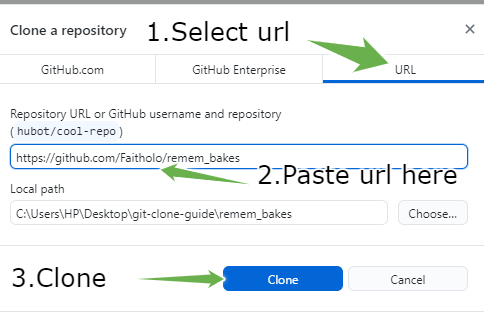
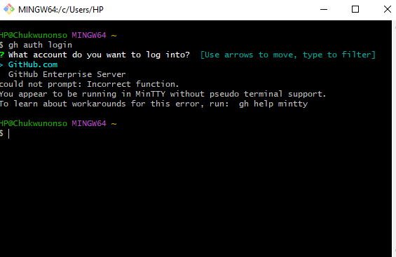

# Introduction to Github

## Table of content
- Introduction 
- What is GitHub
- Why GitHub
- Git vs. GitHub
- Clone (Show how to do cloning)
- Pull request (Show how to do a pull request)
- Commit (Show how to do a commit)
- GitHub Desktop vs. Github CLI
  
## Introduction
The idea of working on fascinating projects is usually enjoyable. However, having answers to "How can we secure the project history and keep track of our progress?" will keep us on the safe side. The goal of this article is to provide answers to this questions using Git and GitHub.


## What is GitHub

The words "Git" and "Hub" makeup GitHub. Let's briefly discuss Git before moving on to what GitHub is.

 Git is a distributed version control system (DVCS), which means that your local machine will have a mirror copy of the full source code and history. Globally, Git is the most adopted version control system in terms of popularity. We could credit this widespread adoption to its compatibility on Windows, MacOS, or Linux operating systems. Below is a walkthrough of the installation process using Windows Operating System. First visit [here](https://git-scm.com/.) to download Git to your machine.


GitHub is a platform for hosting Git repositories on a distant server or the internet. Just so you know, repository means folder. You may also hear some people  refer to repository as "repo" which is a short form for it. GItHub simplifies connecting with developers across the globe. It offers you the chance to improve your skills by contributing to open source projects of others.  Open source are projects that you can contribute to and modify. Git is essential to GitHub which means that GitHub depends heavily on Git.

For you to be able to use GitHub, you need to create an account or sign up by visiting the GitHub website [here](https://github.com/) 

## Why GitHub
Using GiHub offers a lot of advantages. To help you understand why you ought to start utilizing GitHub, I'll outline a few.

- With GitHub, securing your projects with top level security only takes a few seconds.

- GitHub was created with all of your needs in mind,  whether you are a seasoned developer or just getting started.
-GitHub is built with the idea that people are social beings, making it simple for you to connect and cooperate with other developers from across the world and growing your network.
-GitHub allows you to work independently on a personal project as well as with others to collaborate on a collaborative project.
- Using GitHub, you may enhance open source projects in a manner similar to humanitarian aid. 
- Due to the exponential growth of mobile users, GitHub mobile now enables access to your repository from anywhere.
- GitHub is an institution that makes learning accessible to everyone and serves as more than just a platform for storing repositories.
- Non-coders can also utilize GitHub, including designers, writers, and content producers.

## Git vs Github


Despite being combined, Git and GitHub have different features. We will list a handful of them here.

| Git      | GitHub |
| ----------- | ----------- |
| Git can protect your project from anywhere even without an online connection      | GitHub requires connection to save your work on the remote server.       |
|  Git is a software   | GitHub is a service        |
|  Git is distributed.    | GitHub is centralized meaning that it is controlled by an authority.       |
| Git does not manage user data.      | GitHub  manages user data.       |
| Git was created by Linus Torvalds.      | GitHub  was created by Chris Wanstrath, P. J. Hyett, Tom Preston-Werner, and Scott Chacon       |
| Git is written in C programming language      | GitHub  was developed with Ruby on Rails       |
| Git was first launched in 2005.      | GitHub was launched in 2008.      |


### Clone (How to clone)

Git clone is used to copy a repository that already exists on the cloud into your machine. It provides you with all the files and history of the codebase. Cloning can be done using HTTPS or SSH code. Let me show you how. 

Assuming you found the project you want to clone, 

1. Click on the *fork* button
2. Click on the code button located on the right side of the screen  just beside the "Go to file" and "add file".
3. Copy the HTTPS or SSH url. 
4. Move into your desktop folder in your terminal.
5. Type  'git clone'  and paste the HTTPS url. Its a very easy processs.

 The below code describes step four and five above.

 ```
    cd Desktop
    git clone url
```   


The below images illustrates cloning using GitHub desktop. 




It is worth noting that you can only make changes to the file you have cloned if you have write permissions to the repository. This restriction enables GitHub to protect projects.

### Commit (How to commit)

Git commit is always preceded by a very popular command known as the git add. Imagine the git add as a command used to bring all the files we want to take a snapshot of to the stage. The git commit is the command that takes the snapshot. Only staged files can be committed. Committed files represent a safe version of your project, that can be changed only when instruct Git to do so.

```
    git commit -m "This is how to commit"
    
    The flag m stands for message.
```

Errors in the commit message can be overwritten using 

```
 git commit --amend “This is the correct message”
```

### Pull request (How to do a pull request):

Collaborating with others is fantastic and effective collaboration necessitates communication. When a contributor submits a pull request, the project owner is given the opportunity to learn about the change that has been made, examine the changes, and either accept or reject the change. Pull request helps with efficient communication. You can perform pull requests via GitHub, GitHub Desktop, GITHUB CLI, etc. After submitting a pull request, a page comparing the two branches will show up so you can view the differences. To briefly illustrate this

After cloning, Open the folder in your favorite Integrated Development Environment for example VS Code.

lets say you want to make a spelling correction. In your terminal

```
git checkout -b “correct-spelling-error” 
 ```   
    The command creates a new branch called *correct-spelling-error* Go to the file where you want to make changes and perform the change.

    Type the following one after the other


 ```     
    git status to see the files you have modified
    “git diff” shows the differences between the branches
    “git add” the name of the file that you modified 

    or

    git add . to add all files.

    git commit -m “made spelling correction”
    git push origin correct-spelling-error
```

Then go back to github you will find a green button that says *compare and pull request* click it and give a descrription of the change you made and create a pull request. 


## GitHub Desktop vs. Github CLI

### GitHub Desktop
GitHub Desktop, in a nutshell, makes it simpler to work with both local and cloud-hosted repositories and simplifies your work. Eliminating any potential roadblocks and Increasing your productivity are the two main objectives of GitHub desktop.

Visit [this link](https://desktop.github.com/) to get it installed on your local computer.


### GitHub CLI

GitHub CLI stands for GitHub Command Line Interface. It helps you to connect with GitHub from your terminal without having to switch applications. 

Think of the GitHub CLI when you consider ease. It eliminates the need for switching from the terminal to web browser or the GitHub desktop application while trying to access or host a repository. GitHub CLI makes you become accustomed to working with the terminal, which is a crucial skill for you to have. Who doesn't enjoy feeling like a hacker, after all?


To install GitHub CLI is very easy just visit [this link](https://cli.github.com/) and download.

 in your terminal, run the below command

```
    gh auth login
```




| GitHub CLI      | GitHub Desktop |
| ----------- | ----------- |
| GitHub CLI is an interface in your terminal      | GitHub desktop uses GUI       |
|  GitHub CLI is a command line tool   | GitHub desktop is an application.        |
| GitHub CLI uses commands     | GitHub desktop does not use commands.       |
| Downloading GitHub CLI takes smaller memory.       | GitHub desktop requires more memory space.      |


With this that we have covered, you will be able to work with both Git and GitHub and keep track of the projects you are working on without been afraid of losing any of your files and projects. Keep building!

