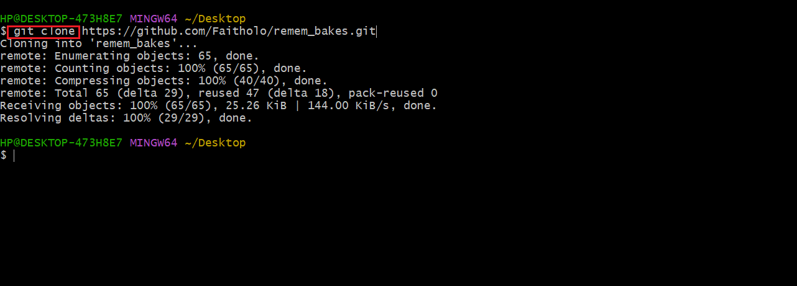
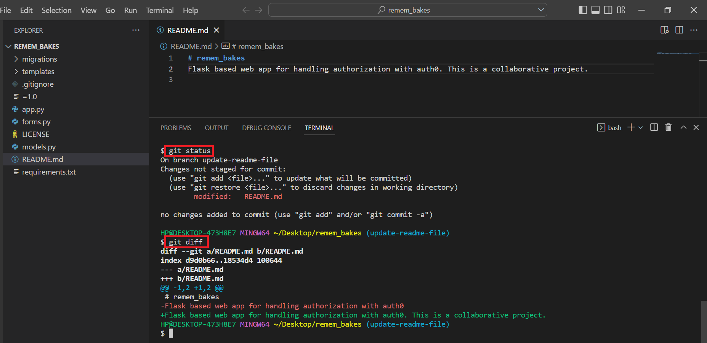
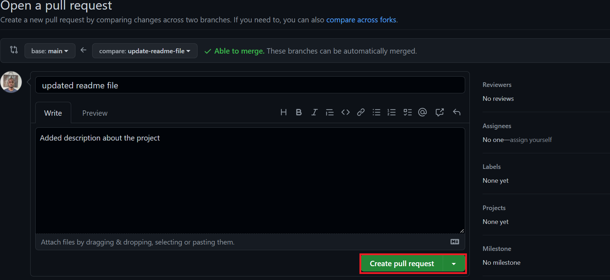

# Introduction to GitHub
You don't have to lose your projects or struggle with collaborating anymore.

* Table of Content
    - Introduction 
    - What is GitHub
    - Why GitHub
    - Git vs. GitHub
    - Commit (how to do a commit)
    - Clone (how to do cloning)
    - Pull request (how to do a pull request
    - GitHub Desktop vs. Github CLI
  
## Introduction

Working on fascinating projects is usually enjoyable. However, we need to secure the project, track progress and even work alongside others.

You may have been told "make sure you have a backup". Well, before the invent of GitHub, developers used punch cards and even USB flash drives for backups. Aside the burden of updating the project after making changes and ensuring the device is well secured, collaboration was hell. Lets discuss how to utilize GitHub while working on our project or as part of a team.

## What is GitHub?

The words "Git" and "Hub" makeup GitHub. What then is Git?


 **Git** is a distributed version control system (DVCS), meaning your local machine gets a mirror copy of the source code and history. Globally, Git is the most adopted version control system in terms of popularity. We could credit this widespread adoption to its compatibility on Windows, MacOS, ond Linux Operating System. Go [here](https://git-scm.com/.) to download Git. <br><br><br>


GitHub is a platform for hosting ` Git ` repositories on a distant server on the internet. GitHub simplifies connecting with developers across the globe. It offers you the chance to improve your skills by contributing to open source projects of others.  Open source are projects that you can contribute to and modify. Git is very essential to GitHub.

*Repository or Repo as some may call it means folder.* 

To use GitHub, you need to sign up on [GitHub](https://github.com/)


<br><br><br>

## Git vs Github

| Git      | GitHub |
| ----------- | ----------- |
| Git can protect your project from anywhere even without an online connection      | GitHub requires connection to save your work on the remote server.       |
|  Git is a software   | GitHub is a service        |
|  Git is distributed.    | GitHub is centralized meaning it is controlled by an authority.       |
| Git does not manage user data.      | GitHub  manages user data.       |
| Git was created by Linus Torvalds.      | GitHub  was collectively created by Chris Wanstrath, P. J. Hyett, Tom Preston-Werner, and Scott Chacon       |
| Git is written in C programming language      | GitHub  is developed with Ruby on Rails       |
| Git was first launched in 2005.      | GitHub was launched in 2008.      |

<br>

## Why GitHub

| Features      | Why use GitHUB |
| ----------- | ----------- |
| 1. Security      | With GitHub, securing your projects with top level security only takes a few seconds.       |
| 2. Ease of Use      | GitHub is suitable for seasoned developer, early career programmers,  designers and writers.       |
| 3. Socials   | GitHub is built with the idea that people are social beings. You can easily connect and collaborate with other developers from across the globe.        |
|4.  Productivity    |  GitHub simplifies working independently on a personal project and with a team for a collaborative project.       |
|5.  Open Source Contribution      | Improving open source project is easy using GitHub.         |
| 6. Education      |  GitHub hosts millions of free repository you can utilize when learning new concepts or preparing for interviews.        |
| 7. Personal  Development    |  With [GitHub education](https://education.github.com/benefits?type=student/), you can access quality resources and gain on demand skills.        |
| 8. Portfolio    |  GitHub showcases personal projects and can be used as portfolio when applying for jobs and grants.   |


<br> <br>
 * Summary of some important Git commands.

    * `git status`: This command gives a summary of our directory. Both staged and unstaged files are shown when we use this git status. 


   * `git add`: One of the most used and simple to remember commands. To stage a file, use this command. Staged files are ones that can be saved using `git commit`. 

                    ```
                    You can stage the files individually using 
                    git add [file name]
                        Or 
                    git add [file name] [file name] [file name] 
                    Use 
                    git add . to stage all files.

                    ```
<br><br>

### Cloning a Repository 

`Git clone` copies a repository that already exists into your machine. It provides all the files and history of the codebase. Cloning can be done using `HTTPS` or `SSH code`. Together, lets clone a repository using HTTPS. 

* How to clone

    When you find the project you want to clone... 

    1. Click on the *fork* button
    2. Click on the *code* button located on the right side of the screen beside the *Go to file* and *add file*.
    3. Copy the `HTTPS url`. 
    4. Move into your desktop folder in your terminal. This can be Git or the intgrated terminal like we have in VS Code.
    5. Type  `git clone`  and paste the `HTTPS url` then hit enter. You have cloned your first repository.<br><br>

Step four and five above is done as shown below.

 ```
    cd Desktop
    git clone HTTPS url
``` 

<br>

<br>


 <br>*Changes you make to projects will be effected only if you have write permissions to the repository. Or if you make a pull request that was accepted.*

<br>

### Commit 

`Git commit` is always preceded by `git add`. `Git commit`  takes  snapshots. Changes made to a file are not saved by `git status` or `git add`. To save changes, use `git commit`. Committed files represent a safe version of your project. This files will only be modified when you instruct Git to do so.Without `git commit`, the remote repository cannot be updated . Only staged files can be committed. 


* How to commit

        git add [file name]

        git commit -m "changed components to class"

 
        The flag `-m` stands for message.<br>

 *To correct an error in commit message use*


        git commit --amend “This is the correct message”


 
* Summary of some advanced commands

    * Git push: On Git, everything we do remains local. To update the remote repository, we employ git push. The `git push`  unifies both local and remote repositories.

   * Git fetch: Changes are downloaded to the local repository using `git fetch` from the remote repository. Git fetch allows us to compare local and remote repositories side by side.
 
   * Git merge: The `git merge` command syncs the local repository with the fetched remote repository.

   * Git pull: The commands `git fetch` and `git merge` are executed simultaneously by `git pull`. The remote repository is used to automatically replace the local repository.<br> <br><br>


### How to Make a Pull Request 

Collaboration is one key features of GitHub. Effective team work necessitates communication. When you pull request, the project owner examines the changes and either accept or reject the change. Pull request helps with efficient communication. You can perform pull requests via GitHub, GitHub Desktop, GITHUB CLI, etc. After submitting a pull request, a page comparing the two branches will show up so you can view the differences. 

 * How to do a pull request

     * Open the cloned folder in your favorite Integrated Development Environment for example Visual Studio Code  using ` cmd + ~`.

<br>

* 


```
git checkout -b “update-readme-file” 
 ```   
    
    
The command creates a new branch called *update-readme-file* and switches to it.  

<br>    
 Make changes in your newly created branch. Then:

   1. git status 
   2. git diff
   3. git add file name or git add . to add all
   4. git commit -m “updated-readme-file”
   5. git push origin update-readme-file


 <br>
 <br>
 <br>


Go back to [GitHub](https://github.com/). If you followed the steps,  you should find a green  button that says *compare and pull request* click it, give a descrription of the change you made then create pull request. 


<br>



### GitHub Desktop
GitHub Desktop, in a nutshell, makes it simpler to work with both local and cloud-hosted repositories and simplifies your work. Eliminating any potential roadblocks and Increasing your productivity are the two main objectives of `GitHub desktop`.

Visit [this link](https://desktop.github.com/) to get it installed on your local computer.


### GitHub CLI

GitHub CLI stands for GitHub Command Line Interface. It connects GitHub to your terminal without switching applications. 

Think of the `GitHub CLI` when you consider ease. GitHub CLI makes you accustomed to working with the terminal - a crucial skill. 


Install [GitHub CLI](https://cli.github.com/).

Run this command in the terminal

```
    gh auth login
```


## GitHub Desktop vs. Github CLI

| GitHub CLI      | GitHub Desktop |
| ----------- | ----------- |
| GitHub CLI is an interface in your terminal      | GitHub desktop uses Graphic User Interface       |
|  GitHub CLI is a command line tool   | GitHub desktop is an application.        |
| GitHub CLI uses commands     | GitHub desktop less commands.       |
| Downloading GitHub CLI takes smaller memory.       | GitHub desktop requires more memory space.      |


## Conclusion
We've seen that with Github, our project is safe and can be accessed from anywhere easily. Although learning this might be intimidating but with the basic commands and features we have covered,  utilizing Git and GitHub for project tracking and also improving the projects of others will be much easier. Thank you for reading and keep building!


### References

* https://git-scm.com/docs
* https://www.atlassian.com/git/tutorials/saving-changes/git-commit
* https://docs.github.com/en